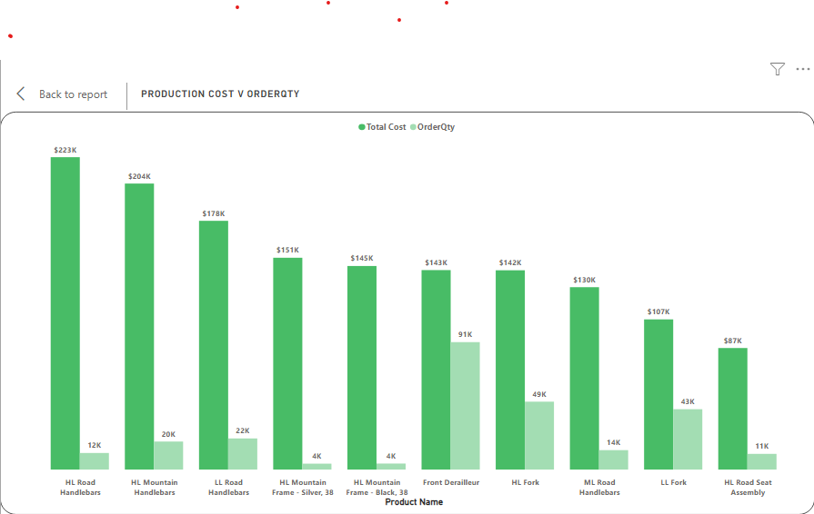
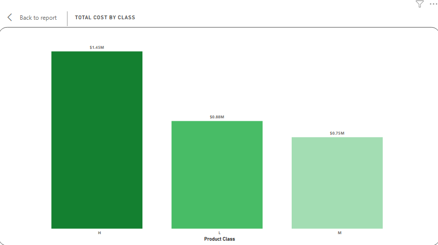
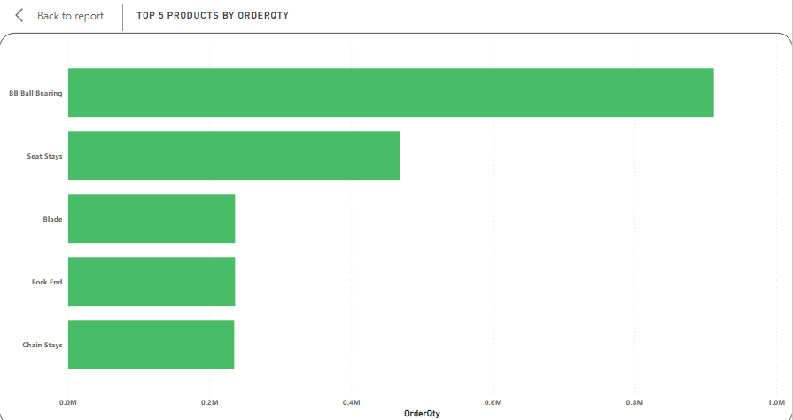
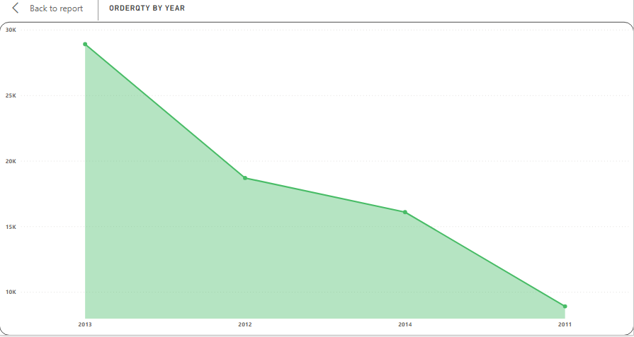
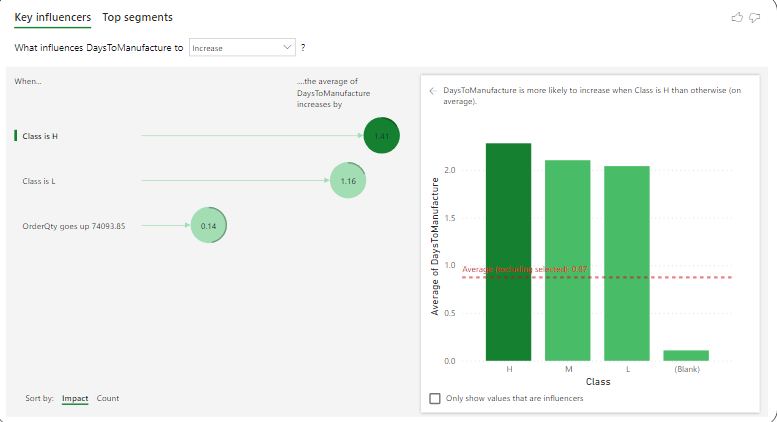
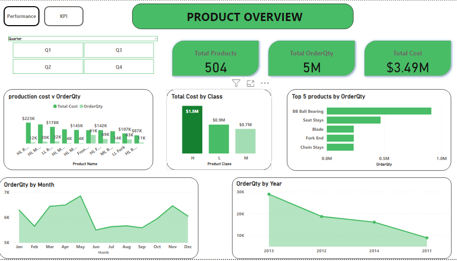

# Adventureworks-product-overview

--

## Introduction
Embark on an exhilarating journey of exploration and discovery as we delve into the captivating world of Adventureworks production data! With an insatiable thirst for learning and a passion for projects, I dived headfirst into the rich realm of Microsoft's Adventureworks database. Join me as I unravel the secrets of the production side, unraveling fascinating insights that will leave you amazed. Let's venture forth and unveil the hidden gems within this enthralling dataset! 🕵‍♂💼📊

## Projrct Goal: Unraveling the Mysteries 🗺
My mission was clear: to perform Exploratory Data Analysis (EDA) on the production data. Brace yourselves for some data magic! ✨

## Tool of Choice 🛠
I made use of PowerBI Desktop for analyisis and dashboard creation and unleashed the visualizations on the PowerBI service. Trust me, it's like wielding a wand of data visualization!

## Skills Demonstrated
- DAX Magic ✨
I conjured AI-integrated DAX solutions, used bookmarks, and activated buttons for an immersive experience

## Exploratory Analysis

### Total Cost of Production per Quantity Ordered
So for the fact that this is production data, Let's talk about cash! I examined the total cost of production related to the quantity of products ordered. The HL Road Handlebars and HL Mountain Handlebars proved to be the gold mines, with costs over 200k! 💰

From the chart we know that of the top 10 products, the HL Road Handlebars and HL mountain Handlebars cost the most to produce with total cost well over 200 thousand dollars, coming in at 223k and 204k respectively, on the flip side, they both have relatively low quantity ordered compared to other products on the top 10 list.

### Total Cost of Production by Product Class
Class matters! I compared production costs among High, Low, and Middle classes. High-class products hit the bank, but surprisingly, Middle and Low classes kept up the pace!

What the chart shows is that products in the high class generally cost more to manufacture than products in the other class, it's a quite logical situation because it is expected that materials used in the production of high class products would be really of better quality. Total cost of manufacturing products in high class was 1.45 million, the Low and middle class cost 800 thousand and 750 thousand respectively. What this tells us is that, in reality there isn't much difference in products of those classes .

### Top Products by Order Quantity
We've compared top products as it relates to cost of production, this time we looked at the top prodcuts based on the quantity of orders, this can mean the products that sell out the most hence they're in demand and the order quantity is a reflection of that.

Now this is an interesting part, remeber when looked at top products based on total cost BB Ball Bearing didn't even make the top 10, but here it is the top product based on the quantity ordered, so what this tell us is that, BB Ball Bearing is not a high class product but it is highly sort after, that's interesting...

### Total OrderQty by Year
What is a sales/product anallysis without a time series analysis, at this point, I had to evaluate quantity of orders over the course of the 4 years in view here (2011-2014) , with a view to understanding how each year faired.

This is clear as day, 2013 had the highest record of orders and 2011 had the lowest, it is worthy to note that there was a decline in the quantity of orders from over 25,000 (25 thousand) in 2013 to just above 15,000 (15 thousand) in 2014, there is no availble data to find out why that is, because that is not the scope of this analysis, but it is a worthy reason to carry out a whole new project to try to answer that question.

### KPI 
While going through the data just at the begining of the project, I noticed that there was data available for the number of days it took to manufacture a particular, if you have been following, you'd recall I mentioned the products were grouped into classes H, L, M , so on that bases, i decided to find out how the class a product belonged to influenced the number of days spent for it's production, the results were interesting,however expected.

like I said earleir, the findings weree quite expected, so what this visual means that for every a High Class product is manufactured, the average number of days it takes to manufacture increases by 1.4 compared to the other classes , the reason I said it is expected, is becuase we expect a production to take longer since the products are of a high class.

### Overview Dashboard
This dashboard shows all the visuals representing all that we've discussed so far, including slicers that enables consumers/users view the report by quarters, the dashboard is fully interactive and fuctional.

### Enjoy some wizkid while you check out the interactivity of the dashboard

https://github.com/benyuro/Adventureworks-product-overview/assets/101714302/8686653d-bdbc-466c-91d6-36eb15641adb

### You can interact with the dashboard here 
https://app.powerbi.com/view?r=eyJrIjoiYTQ4MjI4OTAtMzdiNi00MTYyLWI5OTUtMGYzYWNiOGY1NzdjIiwidCI6IjVjYTg4NzAyLTExNDUtNDlkOS05MWIzLWM3MjFiZWZkMTIwNiJ9

Thanks for sticking with me 
Cheers 

